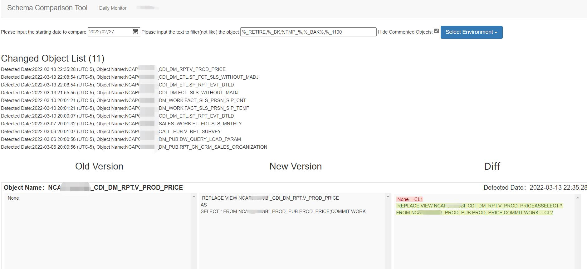

# Data-Schema-Comparison
Inspired by the AWS Glue Crawler, I used python to implement a crawler tool and a website interface.
* The crawler tool can catch the change of schema and store in a SQLite database.
* The website which is based on web.py and jsdiff can present the change captured.

The result of crawl was stored in a sqlite database.  
For now only Teradata is supported.  

## Dependency
### Python
* web.py
* pysqlite3
* Teradata

